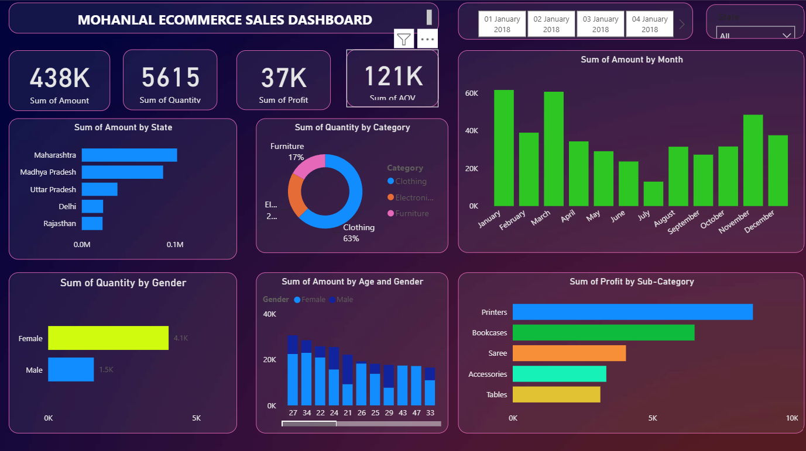

# 📊 Power BI Ecommerce Sales Dashboard

## 📌 Project Overview

This project is an interactive **Power BI Ecommerce Sales Dashboard** designed to analyze sales performance, profit, customer behavior, and regional trends using dynamic visualizations and KPIs.

The dashboard helps businesses monitor key performance metrics and make data-driven decisions through interactive reports.

---

## 📷 Dashboard Preview



---

## 🎯 Objectives

- Analyze overall sales performance
- Monitor total profit and quantity sold
- Identify top-performing states
- Track monthly profit trends
- Analyze sales by category and sub-category
- Understand customer purchasing behavior
- Create an interactive dashboard using Power BI

---

## 📊 KPI Cards

- 💰 Total Sales
- 💵 Total Profit
- 📦 Total Quantity
- 📈 Average Order Value

---

## 📈 Dashboard Visualizations

- Monthly Profit Trend
- Sales by State
- Sales by Category
- Sales by Sub-Category
- Quantity by Payment Mode
- Profit by Month

---

## 🎛 Interactive Filters

- Quarter
- State

---

## 🛠 Tools & Technologies

- Microsoft Power BI
- Power Query
- DAX
- Data Modeling
- Data Visualization

---

## 📂 Dataset

The dashboard is built using an Ecommerce Sales dataset containing:

- Orders.csv
- Details.csv

---

## 📁 Project Structure

```
powerbi-ecommerce-sales-dashboard/
│
├── Dashboard/
│   └── PowerBI_Ecommerce_Sales_Dashboard.pbix
│
├── Dataset/
│   ├── Orders.csv
│   └── Details.csv
│
├── Screenshot/
│   └── powerbi-dashboard.png
│
└── README.md
```

---

## 💡 Key Insights

- Maharashtra generated the highest sales.
- Clothing category contributed significantly to overall sales.
- UPI and COD were among the most used payment methods.
- Profit trends varied across different months.
- Interactive filters enable dynamic business analysis.

---

## 🚀 Features

- Interactive Dashboard
- KPI Cards
- Dynamic Charts
- Slicers
- Business Insights
- Responsive Report Layout

---

## 📚 Skills Demonstrated

- Power BI
- Power Query
- DAX
- Dashboard Design
- Data Cleaning
- Data Visualization
- Business Intelligence
- Data Analysis

---

## 👨‍💻 Author

**Pratik Shigwan**

Aspiring Data Analyst

### Connect with Me

- GitHub: https://github.com/shigwanpratik7-oss
- LinkedIn: https://www.linkedin.com/in/pratik-shigwan-3a77a8365/